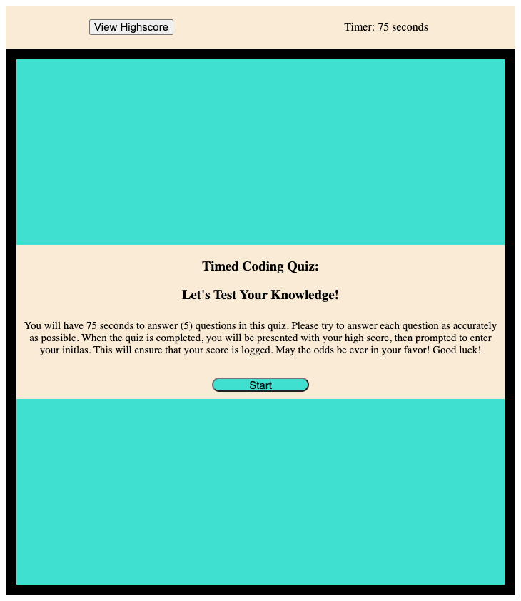
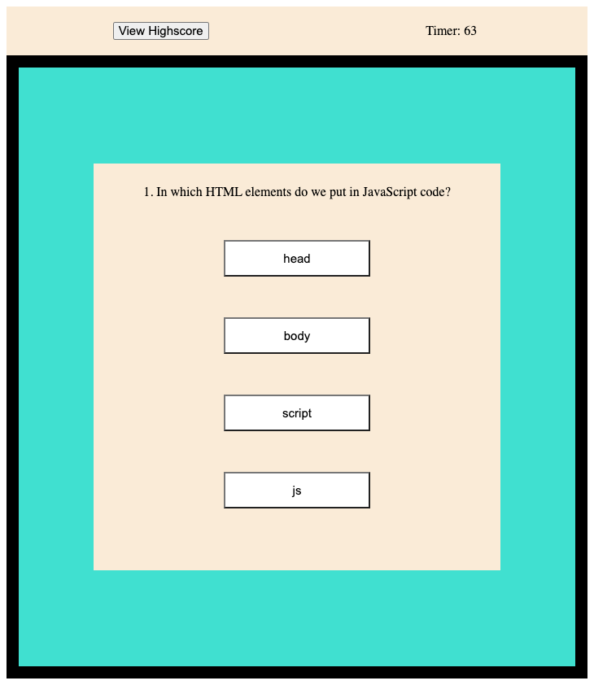
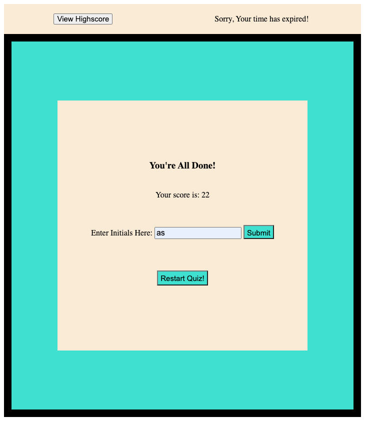
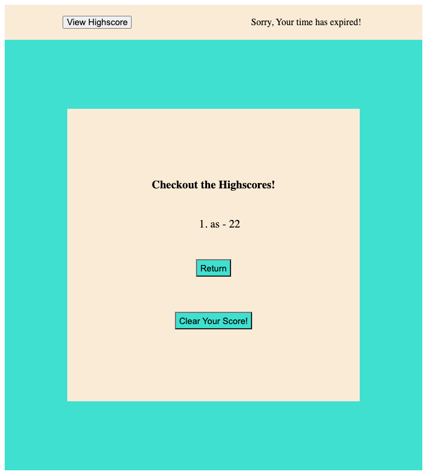

# take-my-coding-quiz

## Description

- I created a timed coding quiz for the user to be able to utilize to test their JavaScript skills. This quiz allows the user to answer the questions while providing them with an answer of 'correct' or 'incorrect' upon entering their answer. The challenge of this quiz is to answer correctly, because answering incorrectly will cause their time to be deducted by 10 seconds immediately. Once the quiz is completed the user's highscore will be revealed and their initals will be logged to record their score. The user will then have the option to clear the highscore or to restart the quiz for another try. This quiz will help increase the user's JavaScript knowledge and add a little fun and competition as well. In this application, I really learned how to easily declare variables as well as properly call a function. The most exciting part of coding this application was witnessing the functionality of the timer. It was extremely rewarding.

## Usage 

Screenshots of application:

- 
- 
- 
- 

- Step One: Read the instructions to the quiz.
- Step Two: Once the "start" button is pressed the timer will begin to countdown and the first question will populate.
- Step Three: As you answer each question you will receive a 'correct' or 'incorrect' response.
- Step Four: If an 'incorrect' answer is given 10 seconds will be deducted from your time automatically.
- Step Five: After each question has been answered, you will be shown your score and asked to enter your initals for your score to be recorded.
- Step Six: Your score will be logged into the highscores list and you will have the option to clear your score or restart the quiz for a higher score.

## Credits
- Georgia Tech Coding Bootcamp
- Mazin Abed
- Nnamdi Onyeije

## License
[Link to MIT Licence here:](https://github.com/bundleofcodes/take-my-coding-quiz/blob/main/LICENSE)

## Features
- Scoring
- Buttons
- Clickable Links
- Timer
- Text Input
